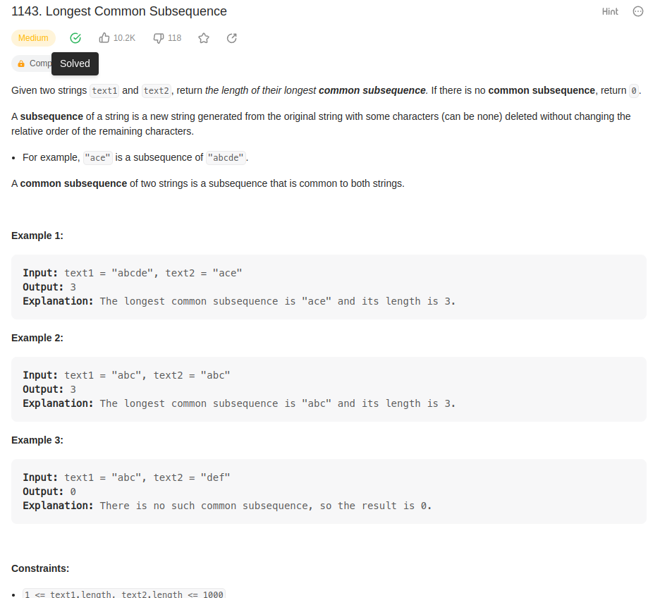
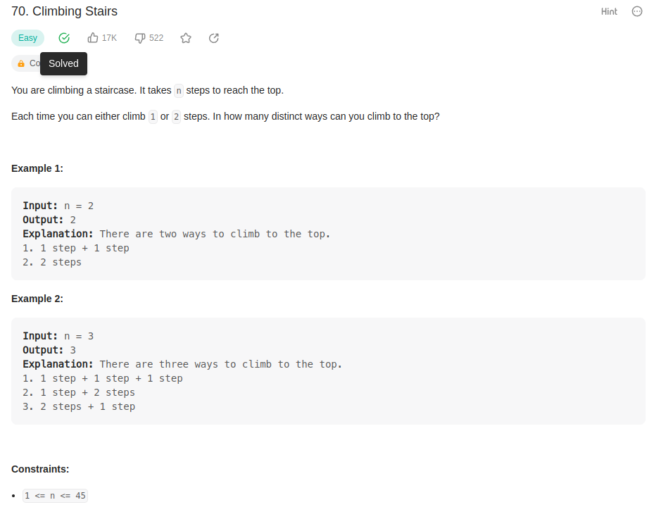
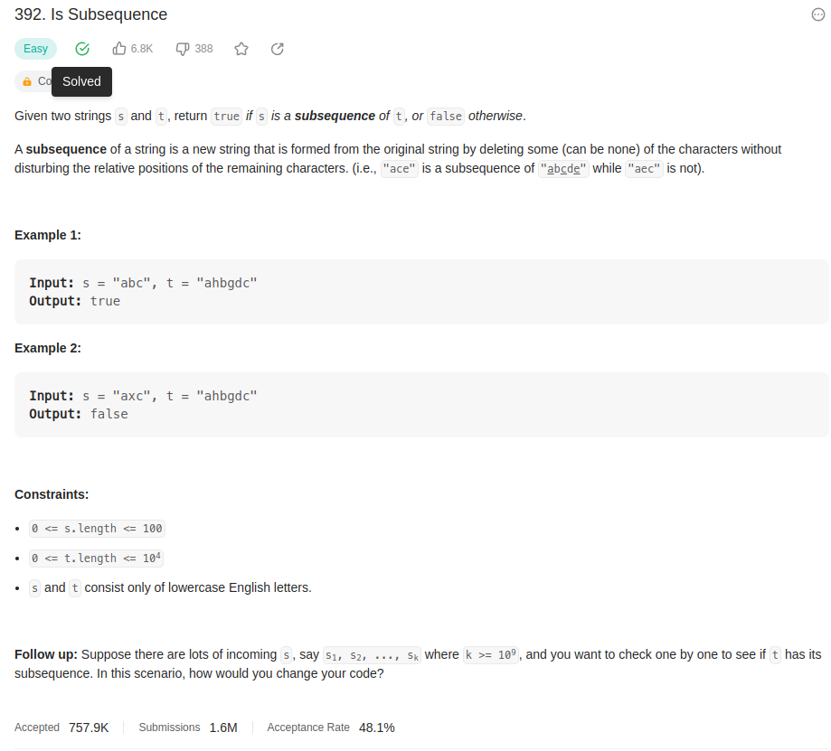

#PD_exercicios_31

**Número da Lista**: 31 
**Conteúdo da Disciplina**: Programação Dinâmica  

## Alunos
|Matrícula | Aluno |
| -- | -- |
| 180117548  | Bruno Carmo Nunes |
| 170150747 |  Marcos Vinícius Rodrigues |

## Sobre 
Contem exercícios resolvidos pela dupla sobre programação dinamica

## Screenshots

https://leetcode.com/problems/longest-common-subsequence

https://leetcode.com/problems/climbing-stairs/description/

https://leetcode.com/problems/is-subsequence/description/
## Uso 
Ter uma conta no site leetcode.com para submeter a resposta.